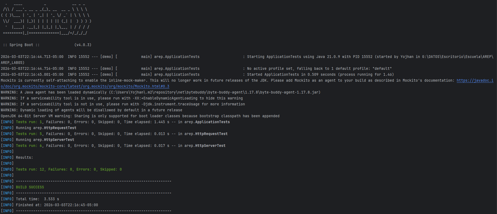
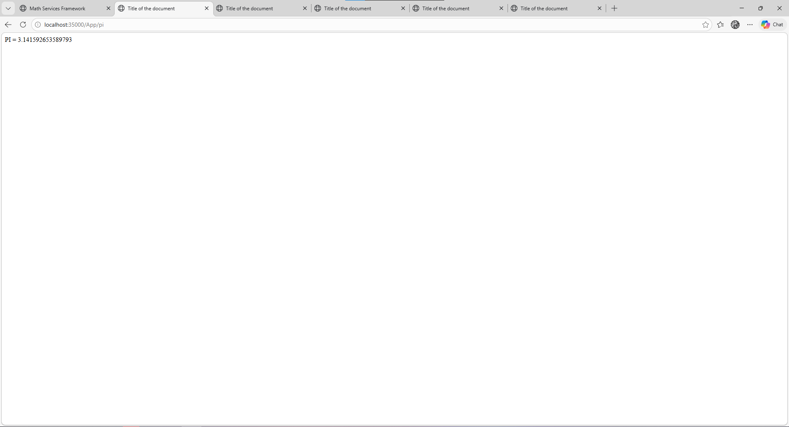
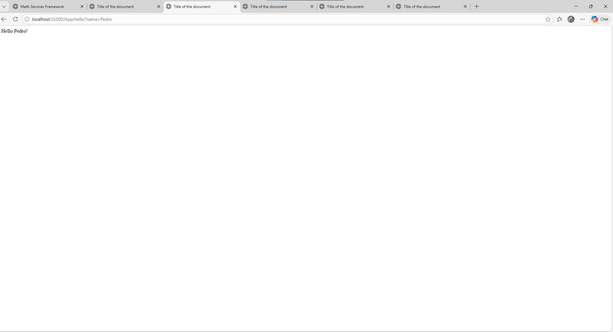
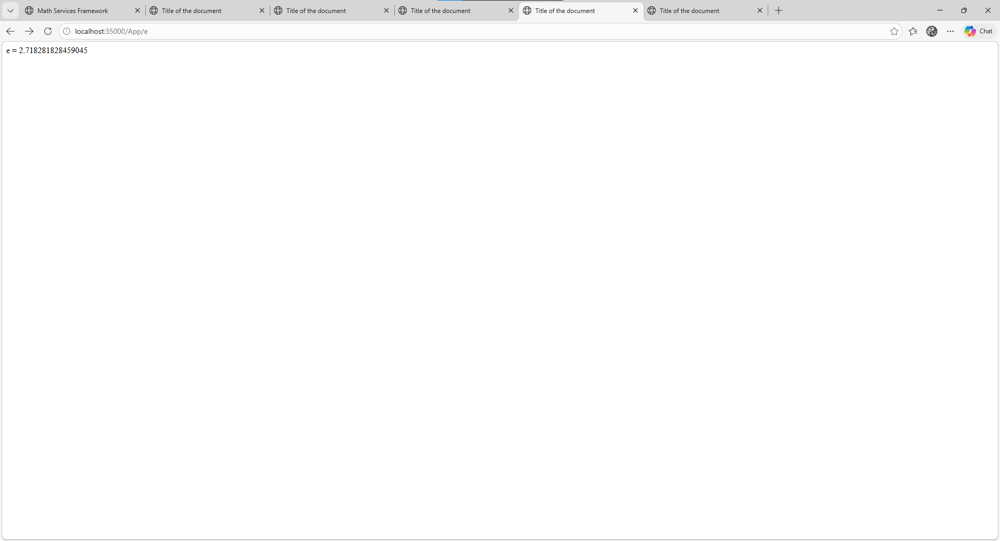
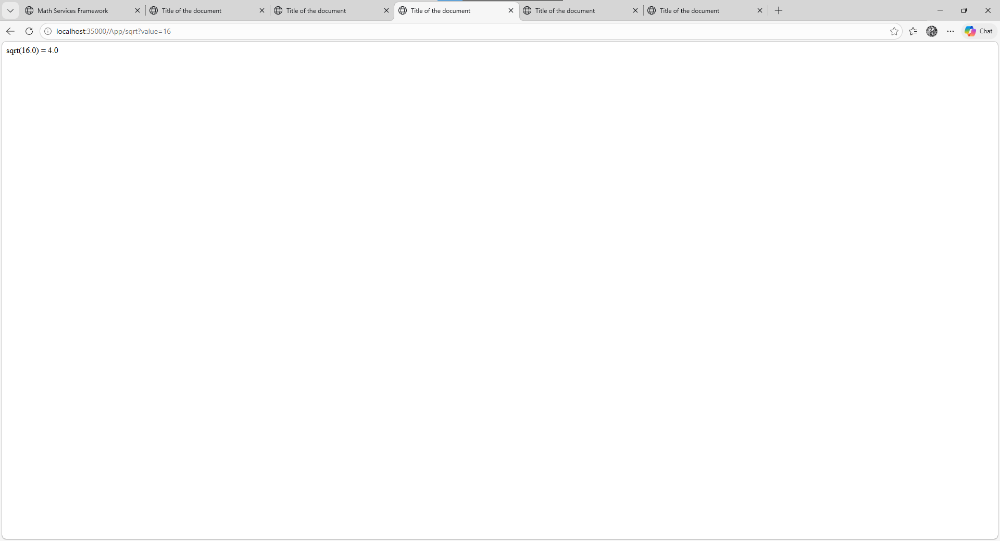
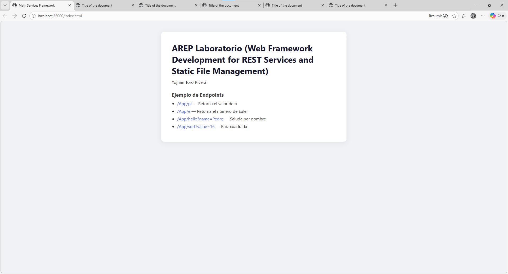
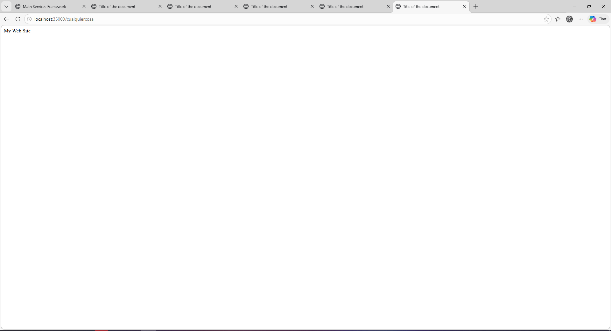

# Web Framework Development for REST Services and Static File Management

Framework web liviano desarrollado en Java puro (sin dependencias externas) que permite construir aplicaciones web con servicios REST usando funciones lambda, manejo de parámetros de consulta y servicio de archivos estáticos.

## Comenzando

Estas instrucciones te permitirán obtener una copia del proyecto en tu máquina local para desarrollo y pruebas.

### Prerrequisitos

- Java 21 o superior
- Maven 3.8 o superior
- Git

Verificar instalaciones:

```bash
java -version
mvn -version
```

### Instalación

Clona el repositorio:

```bash
git clone https://github.com/Yojhan-Toro/AREP_LAB05.git
cd arep-lab05
```

Compila el proyecto:

```bash
mvn compile
```

Inicia el servidor corriendo la aplicación de ejemplo:

```bash
mvn exec:java "-Dexec.mainClass=arep.appexample.MathServices"
```

Verifica que el servidor esté corriendo — deberías ver en consola:

```
Endpoint registrado: GET /App/hello
Endpoint registrado: GET /App/pi
Listo para recibir...
```

## Uso del Framework

Así es como un desarrollador construye una aplicación sobre el framework:

```java
public static void main(String[] args) throws IOException {
    staticfiles("/webroot/public");                             
    get("/App/hello", (req, res) -> "Hello " + req.getValues("name") + "!");
    get("/App/pi",    (req, res) -> String.valueOf(Math.PI));
    HttpServer.main(args);
}
```

## Ejecutando las Pruebas

### tests con JUnit

El proyecto cuenta con una serie de pruebas que se ejecutaran con:
```
mvn test
```



Con el servidor corriendo en el puerto 35000, prueba las siguientes URLs en el navegador o con curl:

### Pruebas de endpoints REST


curl http://localhost:35000/App/pi


curl "http://localhost:35000/App/hello?name=Pedro"


curl http://localhost:35000/App/e


curl "http://localhost:35000/App/sqrt?value=16"


## Pruebas de archivos estáticos


### Página HTML
curl http://localhost:35000/index.html



### Prueba de ruta no existente (fallback)

curl http://localhost:35000/ruta-inexistente



## Arquitectura

```
src/
└── main/
    ├── java/arep/
    │   ├── HttpServer.java      
    │   ├── HttpRequest.java     
    │   ├── HttpResponse.java     
    │   ├── WebMethod.java       
    │   └── appexample/
    │       └── MathServices.java 
    └── resources/
        └── webroot/public/      
            ├── index.html
            ├── style.css
            └── app.js
```

El servidor escucha en el puerto **35000**, parsea la línea de petición HTTP, busca el path en el mapa de endpoints registrados y, si no lo encuentra, intenta servir el archivo estático correspondiente desde el classpath.

## Construido Con

* [Java 21](https://www.oracle.com/java/) - Lenguaje de programación
* [Maven](https://maven.apache.org/) - Gestión de dependencias y construcción
* [Git](https://git-scm.com/) - Control de versiones

## Autor

* **Yojhan Toro Rivera** 
